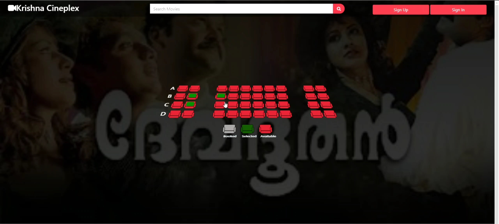

# Movie Booking Website

## Overview

This project is a movie booking website developed using Python and Django framework, providing users with an intuitive platform to book movie seats. The website features a secure and smooth transaction process, as well as a real-time seat selection feature.

## Features

- **User Registration and Authentication**: Secure user signup and sign-in functionality.
- **Movie Listings**: View and select from a variety of movies.
- **Seat Selection**: Real-time view of available seats and booking.
- **Payment Gateway**: Integrated Razorpay for secure transactions.
- **Responsive Design**: Front-end developed with HTML, CSS, JavaScript, and Bootstrap.

## Technologies Used

- **Frontend**: HTML, CSS, JavaScript, Bootstrap
- **Backend**: Python, Django
- **Payment Integration**: Razorpay





## Setup and Installation

1. **Clone the repository**:
    ```bash
    git clone <repository-url>
    cd movie-booking-website
    ```

2. **Create a virtual environment**:
    ```bash
    python -m venv env
    source env/bin/activate   # On Windows use `env\Scripts\activate`
    ```

3. **Install the dependencies**:
    ```bash
    pip install -r requirements.txt
    ```

4. **Setup the database**:
    ```bash
    python manage.py migrate
    ```

5. **Create a superuser**:
    ```bash
    python manage.py createsuperuser
    ```

6. **Run the development server**:
    ```bash
    python manage.py runserver
    ```

7. **Access the website**:
    Open your browser and go to `http://127.0.0.1:8000`.

## Payment Gateway Setup

To integrate Razorpay, you need to have a Razorpay account. Follow these steps:

1. **Sign up on Razorpay**: Create an account on [Razorpay](https://razorpay.com/).
2. **Get API Keys**: Obtain your Razorpay API keys from the Razorpay Dashboard.
3. **Add API Keys**: Update your Django settings with the Razorpay API keys:
    ```python
    RAZORPAY_API_KEY = 'your_api_key'
    RAZORPAY_API_SECRET = 'your_api_secret'
    ```

## Usage

1. **Register/Login**: Create an account or log in to your existing account.
2. **Browse Movies**: View the list of available movies.
3. **Select Seats**: Choose your desired seats in real-time.
4. **Make Payment**: Complete the booking by making a payment through Razorpay.
5. **Enjoy**: Receive booking confirmation and enjoy your movie!


## Contact

For any inquiries or issues, please contact [akshaychathanzz2000@gmail.com].
